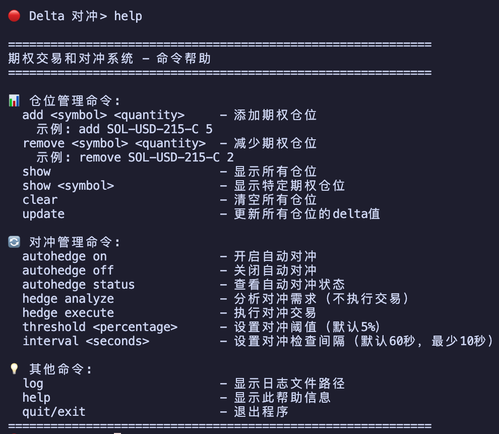

# 原理

这是一个使用lighter零手续费机制，对冲paradex上期权以便于获得资金费收入的程序

目前只考虑对冲期权的delta值，可以设置不同的阈值以便于调整对冲频率

需要先手动在paradex上下单，然后添加在数据库中，记得期权名字要写对
张数买是正的，买是负的
lighter当前需要邀请码

## 使用方式

+ 将 `.env.example` 文件名修改为 `.env`， 填写对应的api信息
+ 运行 `pip install uv`
+ 运行 `uv run main.py`

## 各文件用途

+ `main.py` 程序入口
+ `hedge_system.py` 对冲逻辑实现
+ `lighter_account.py` 获取lighter账户持仓信息
+ `lighter_market.py` 获取lighter当前市场的基本信息
+ `lighter_trading.py` 提供在lighter平台下单功能
+ `option_positions_db.py` 管理paradex平台当前期权仓位（需手动添加）
+ `paradex_market.py` 获取paradex平台信息（期权的delta之类的）
